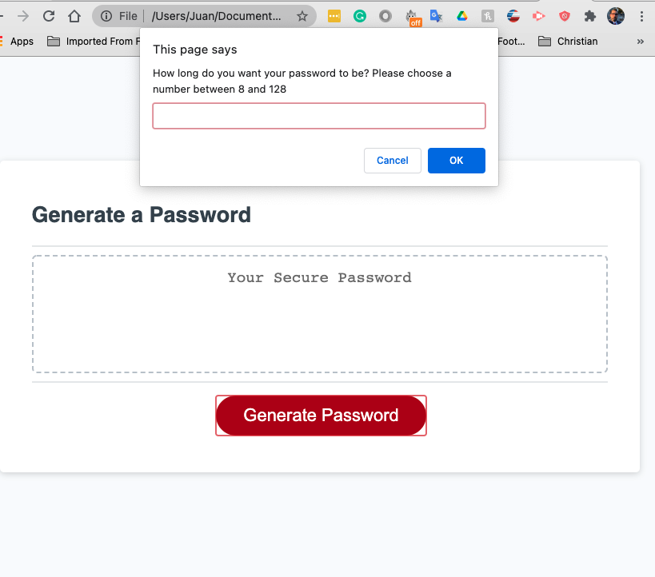
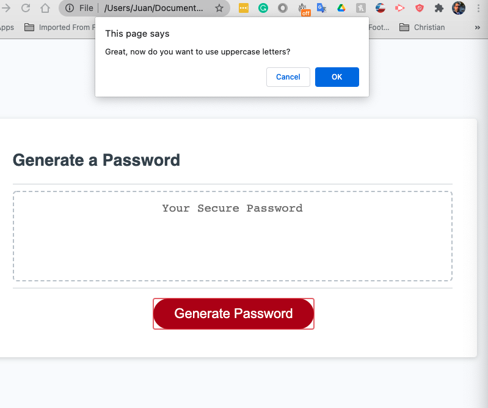
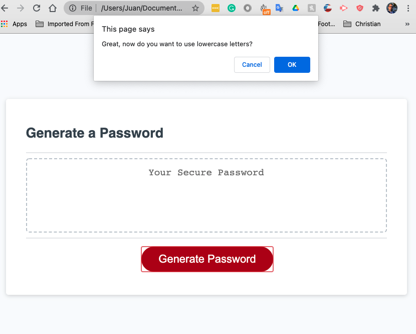
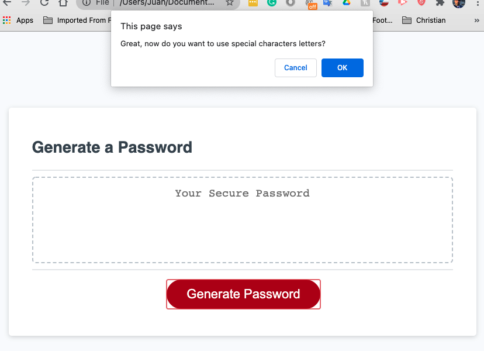
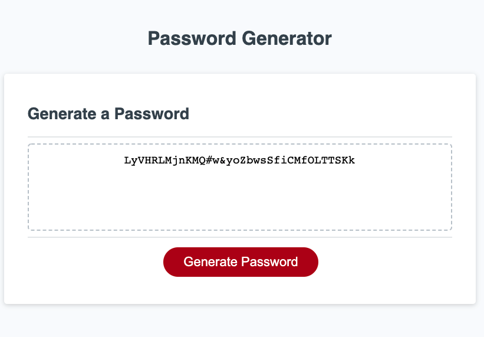

# Password-Generator
This is a password generator built for generating passwords using Javascript 

It generates passwords with a length of 8 to 128 and uses user prompts to determine what characters (uppercase, lowercase, and special characters) the password will contain. 

## Table of Contents

* [Javascript](#JS)
* [Requirements](#Requirements)
* [Installation](#Installation)
* [Contributing](#Contributing)

## JS 
Created a series of prompts that if validated by the user than run through a loop several times (until the length of characters that the user requested is reached). After passing through this loop and being filtered out to remove the 'undefined' characters the charaters are then added to the password variable which is then in turn sent to the next fucntion which writes this password in the text area for the user to see. 

Link to deployed password generator: [Deployed site](https://jd-jaramillo.github.io/password-generator/)

## Requirements
GIVEN I need a new, secure password
WHEN I click the button to generate a password
THEN I am presented with a series of prompts for password criteria
WHEN prompted for password criteria
THEN I select which criteria to include in the password
WHEN prompted for the length of the password
THEN I choose a length of at least 8 characters and no more than 128 characters
WHEN prompted for character types to include in the password
THEN I choose lowercase, uppercase, numeric, and/or special characters
WHEN I answer each prompt
THEN my input should be validated and at least one character type should be selected
WHEN all prompts are answered
THEN a password is generated that matches the selected criteria
WHEN the password is generated
THEN the password is either displayed in an alert or written to the page

## Installation

There is no need to install anything, to use the password generator simply follow the link below. 

See deployed site here: [Deployed Site](https://jd-jaramillo.github.io/password-generator/)

See repository here: [GitHub Repo](https://github.com/JD-Jaramillo/password-generator)

## Contributing

If you have any tips or ideas on how to improve this password generator please reach out to me directly. 

Email: Jaramillo784@gmail.com
